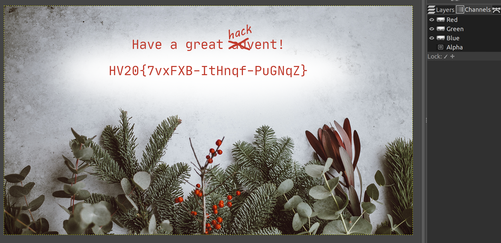

# HV20.01 Happy HACKvent 2020

| <!-- --> | <!-- --> |
| --- | --- |
| **Author**     | mij-the-dj |
| **Level**      | easy |
| **Categories** | `forensics` |

## Description
Welcome to this year's HACKvent.

Attached you can find the "Official" invitation to the HackVent.

One of my very young Cyber Elves cut some parts of the card with his alpha scissors.

Have a great HACKvent,

– Santa

## Approach
The "alpha scissors" hint in combination with the image's different appearance when being opened on my system made me think quickly that there must be a transparency (or "alpha") channel in the image.

Using the GIMP, I hid the image's Alpha channel and left RGB channels visible. That's how the flag became visible:

## Tools
- [The GIMP](https://www.gimp.org/)

## Flag
`HV20{7vxFXB-ItHnqf-PuGNqZ}`
