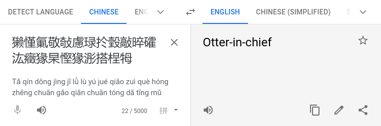

# HV20.02 Chinese Animals

| <!-- --> | <!-- --> |
| --- | --- |
| **Author**     | The Compiler  |
| **Level**      | easy |
| **Categories** | `fun` |

## Description
I've received this note from a friend, who is a Chinese CTF player:

`恭喜！收旗爲：ＨＶ２０｛獭慬氭敬敧慮琭扵瑴敲晬礭汯癥猭杲慳猭浵搭桯牳ｅ`

Unfortunately, Google Translate wasn't of much help: 

I suspect the data has somehow been messed up while transmitting it.

Sadly, I can't ask my friend about more details. The Great Chinese Firewall is thwarting our attempts to reach each other, and there's no way I'm going to install WeChat on my phone.

## Approach
Encodings, encodings...

This challenge was pretty much a guessing challenge as there were no real hints in the challenge description. This confused me as my first reflex was indeed to go for an encoding-related solution. However, I then remembered previous CTFs with similar rabbit holes which ended up nowhere, so I refrained and tried to make sense from the "hints" at hand.

Turns out, I have a talent to go down rabbit holes. In the end, we simply had to encode the string in the flag with **UTF-16BE**, which produces the string `small-elegant-butterfly-loves-grass-mud-hors`, which in turn looks strangely like the contents of a HV20 flag.

## Tools
- [CyberChef](https://gchq.github.io/CyberChef)

## Flag
`HV20{small-elegant-butterfly-loves-grass-mud-horse}`
