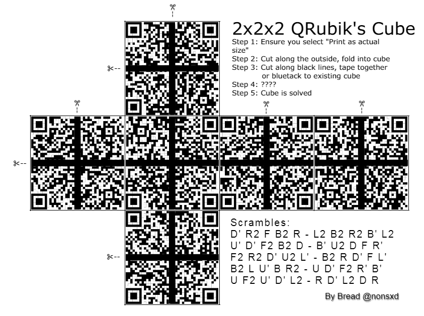
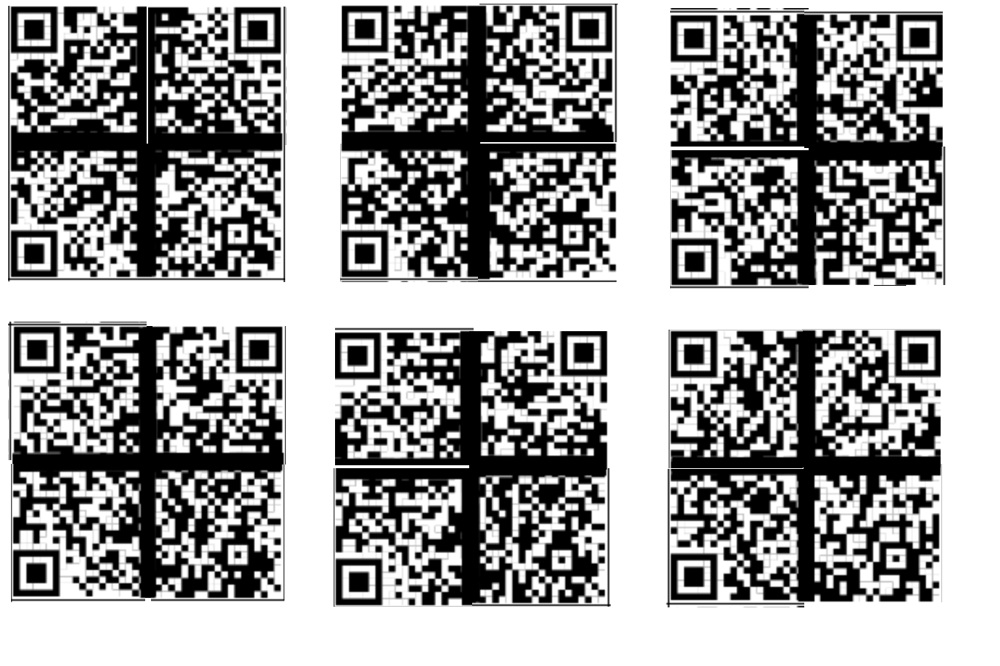

# HV20.06 Twelve steps of christmas

| <!-- --> | <!-- --> |
| --- | --- |
| **Author**     | Bread (aka 🍞) |
| **Level**      | medium |
| **Categories** | `fun` |

## Description

On the sixth day of Christmas my true love sent to me...

- six valid QRs,
- five potential scrambles,
- four orientation bottom and right,
and the rest has been said previously.



[PDF version](./aea7c5d7-2cd3-4c23-8711-5579f766549c.pdf)
[Source image](./7745495e-d40f-49e5-85d7-749a562beff9.pxd) (open with [pixlr.com](https://pixlr.com/e/))

### Requirements
- a printer

### Hints
- selbmarcs
- The black lines are important - do not remove them


## Approach

Cut image into tiles:
```bash
convert cropped.png -crop 189x189 +repage +adjoin rubiks_pieces.png
```

Next, I looked for a 2x2 Rubiks Cube solver, which I found at https://github.com/MeepMoop/py222.

With the following minor adjustment, each tile had an index, which allowed to identify tiles even after scrambling the cube.
```diff
diff --git a/py222.py b/py222.py
index 257882e..54bf3e4 100644
--- a/py222.py
+++ b/py222.py
@@ -110,7 +110,8 @@ fact6 = np.array([720, 120, 24, 6, 2, 1])
 
 # get FC-normalized solved state
 def initState():
-  return np.array([0, 0, 0, 0, 1, 1, 1, 1, 2, 2, 2, 2, 3, 3, 3, 3, 4, 4, 4, 4, 5, 5, 5, 5])
+  # return np.array([0, 0, 0, 0, 1, 1, 1, 1, 2, 2, 2, 2, 3, 3, 3, 3, 4, 4, 4, 4, 5, 5, 5, 5])
+  return np.array(range(0, 6*4))
 
 # apply a move to a state
 def doMove(s, move):
```

"selbmarcs" ==> "scrambles" reversed, so undo scrambles according to the World Cube Association (WCA) notation standard. To reverse, we need to reverse the order and swap directions on 90° rotations. With that, basically, X' becomes X and X becomes X'.

With that, we could apply one scramble after another and check whether each one of the 6 sides had three big and one small QR code target. Checking this prevented us from having to keep track of a tile's orientation (which - as it turned out - would have been useful for the challenge on day 16).

**Scramble 4** was the winner: 
```
# Scramble 4
print("Scramble 4")
s = initState()
# Forward
# s = doAlgStr(s, "B2 L U' B R2 U D' F2 R' B'")
# Reverse
s = doAlgStr(s, "B R F2 D U' R2 B' U L' B2")
printCube(s)
```

(The full source code can be found [here](./dec06.tar.gz)).

After adjusting the orientation of all tiles, the following image could be made in GIMP:


The following strings could be read from the QR codes:
```
Face 16, 09, 18, 19 ==> "HV20{Erno_"
Face 04, 01, 10, 17 ==> "Rubik_would"
Face 11, 21, 15, 23 ==> "_be_proud."
Face 13, 20, 00, 03 ==> "Petrus_is"
Face 14, 12, 07, 08 ==> "_Valid."
Face 05, 06, 02, 22 ==> "#HV20QRubicsChal}"
```

## Tools
- Imagemagick (convert)
- python
- GIMP

## Flag
`HV20{Erno_Rubik_would_be_proud.Petrus_is_Valid.#HV20QRubicsChal}`
