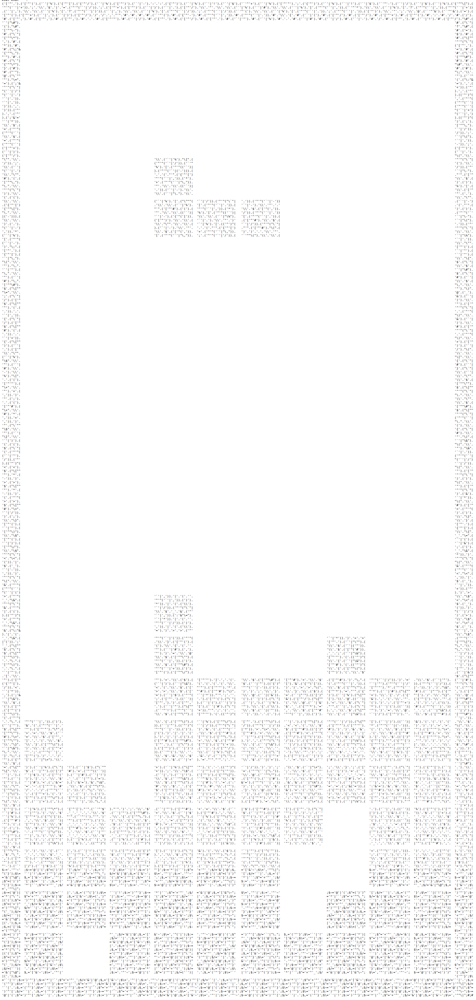
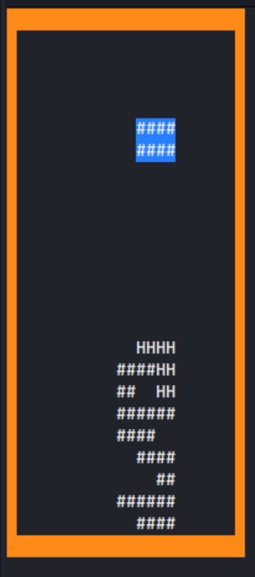

# HV20.08 The game

| <!-- --> | <!-- --> |
| --- | --- |
| **Author**     | M. (who else) |
| **Level**      | medium |
| **Categories** | `reverse engineering`, `fun` |

## Description

Let's play another little game this year. Once again, as every year, I promise it is hardly obfuscated.

[Download](./1456c098-0318-4370-ae1f-c4f6e51e2d50.txt)

### Requirements
Perl & Term::ReadKey module (from CPAN or apt install libterm-readkey-perl for debian / ubuntu based systems)

## Approach

### Analysis
The supplied txt file contained a perl program (hey, it's M.!). Zooming out in a browsers let's you see the full beauty of *M.*'s challenge:



Running the program started a colorful Tetris game in the console with blocks containing flag characters:



So beatiful, despite being written in perl (😉). I mean, who does that? *M.* you are an artist!

### Solution
- Replace the first `eval` statement by a `print` statement to obtain a less obfuscated perl script.
- Make the code readable by running `perltidy script.pl`.
- Find the "flake" (I just created this word, it's a mixup of *fake* and *flag*): `HV20{https://www.youtube.com/watch?v=dQw4w9WgXcQ}`
- Keep humming "Never gonna give you up..."
- Make sure the infinite loop towards the end of the script never ends by commenting out all `last ...` statements.
- Try to find the variable holding the flags characters - it's variable `$bc` on line  44.
- Add a print (to STDERR) statement right before that line: `print { *STDERR } $bc;`.
- Run the script and redirect error output to a file: `perl script_04_solved.pl 2>out.txt`.
- Re-arrange the text a bit and profit.

The patch:
```diff
--- script_03_tidied.pl 2020-12-08 22:15:11.467291509 +0100
+++ script_04_solved.pl 2020-12-08 22:27:33.604678583 +0100
@@ -39,6 +39,7 @@
 
 sub _s {
     ( $b, $bc, $x, $y ) = @_;
+    print { *STDERR } $bc unless '#' eq $bc;
     for $yy ( 0 .. 2 ) {
         for $xx ( 0 .. 5 ) {
             substr( $f[ $yy + $y ], ( $xx + $x ), 1 ) = $bc
@@ -101,7 +102,7 @@
 n();
 while (1) {
     $k = k();
-    last if ( $k =~ /q/ );
+    #last if ( $k =~ /q/ );
     $k  = substr( $k, 2, 1 );
     $dx = ( $k eq 'C' ) - ( $k eq 'D' );
     $bx += $dx unless ( cb( $__, $bx + $dx, $by ) );
@@ -113,7 +114,7 @@
     bl( $__, $_b, 101 + $bi, $bx, $by );
     select( undef, undef, undef, 0.1 );
     if ( cb( $__, $bx, ++$by ) ) {
-        last if ( $by < 2 );
+        #last if ( $by < 2 );
         _s( $__, $_b, $bx, $by - 1 );
         n();
     }
```

The scripts in their different stages:
- 0: [Original script](./script_00.pl)
- 1: [Script](./script_01_print_eval.pl) printing the script after obfuscation stage 1.
- 2: The slightly more readable [script](./script_02_deobfuscated.pl) after obfuscation stage 1.
- 3: The tidied up [script](./script_03_tidied.pl).
- 4: The [script](./script_04_solved.pl) with the solving patch applied.

## Tools
- perl - what a surprise
- perltidy - readable code is comprehensible code
- bash

## Flag
`HV20{https://www.youtube.com/watch?v=Alw5hs0chj0}`
