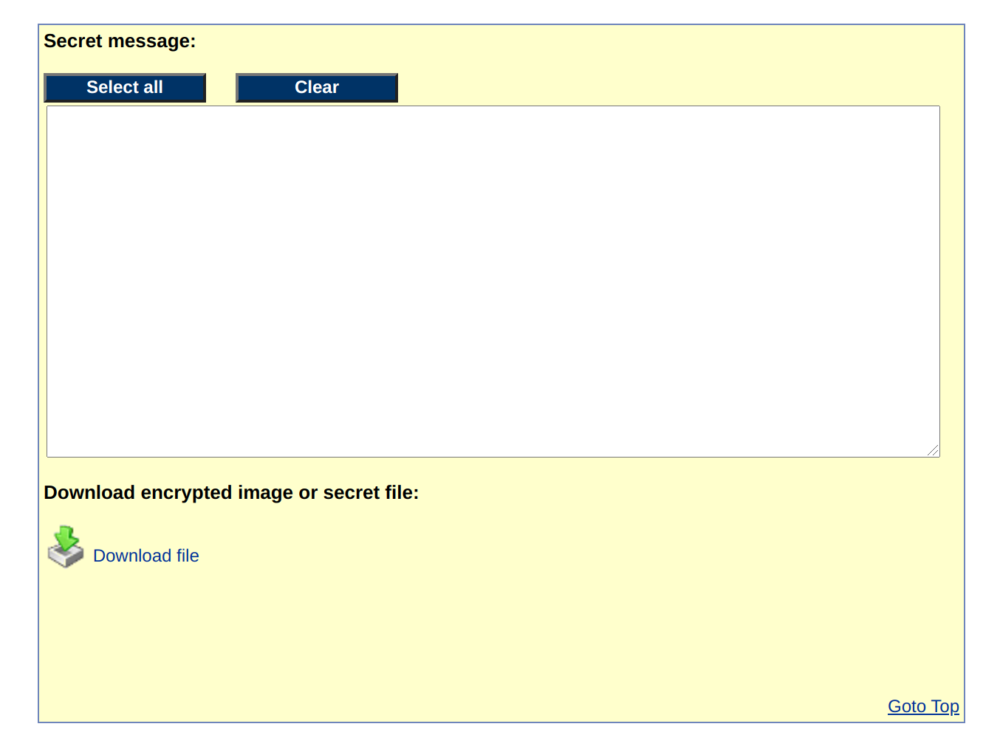

# HV20.11 Chris'mas carol

| <!-- --> | <!-- --> |
| --- | --- |
| **Author**     | Chris |
| **Level**      | medium |
| **Categories** | `crypto`, `forensic` |

## Description

Since yesterday's challenge seems to have been a bit on the hard side, we're adding a small musical innuendo to relax.

My friend Chris from Florida sent me this score. Enjoy! Is this what you call postmodern?


P.S: Also, we're giving another 24h to get full points for the last challenge.

### Hints
He also sent [this image](./f3d66342-bdbc-4fe6-859a-385300057e07.png), but that doesn't look like Miami's skyline to me.
The secret code is useful for a file - not a website

## Approach

Since I'm not really a musician, I started off with the hints. Using Google Image search, one finds out quickly that the image in the hints shows Hong-Kong, rather than Miami - but how does this help us?

Only on a second look, I discovered the link to a steganography page at https://www.mobilefish.com/services/steganography/steganography.php

It seemed clear that the sheet music image had to be uploaded there to extract some information - but what was the password to be used? It turns out, there wasn't any password for that step. One only had to overcome the especially bad UX of mobilefish.com and scroll down enough to discover the now uncovered file called `flag.zip`.



The resulting zip file, however, was password protected. 

At that point, I feared I still had to interprete the sheet music somehow - which turned out to be right. The music, however, was special. Signs for this was the 16/16 rythm and the small `0x` signs, which I've never seen on sheet music before. 

I started reading the music using and interpretion help https://de.wikihow.com/Musiknoten-lesen. The result did only use sounds between A-F, never G, which confirmed its special nature. The result did not make sense yet, though.

The missing part were the octaves. Using https://en.wikipedia.org/wiki/Scientific_pitch_notation I added numbers, so I ended up with hex numbers:
```
e3 b4 f4 e3 d3 e2 d3 a5 b5 d5 a2 e5 a5 e3 a3
b3 e3 d5 d3 a3 d1 a1 c4 e3 e4 d1 d4 d1 d3 d1
```

After XORing the two, the following string was the result: `PW!0p3raV1s1t0r`

With that string, the zip file found earlier was extractable and the flag could be found in `flag.txt`.

To conclude this challenge, it is still not entirely clear to me how mobilefish.com embeds the information into pngs and whether that information can be extracted using another tool than mobilefish.com.

## Flag
`HV20{r3ad-th3-mus1c!}`

## Credits
Thanks to mcia for helping out and keeping me on the right track, when I almost let myself fool by the bad Mobilefish UX, which made it easy to not see that there was in fact a result...
