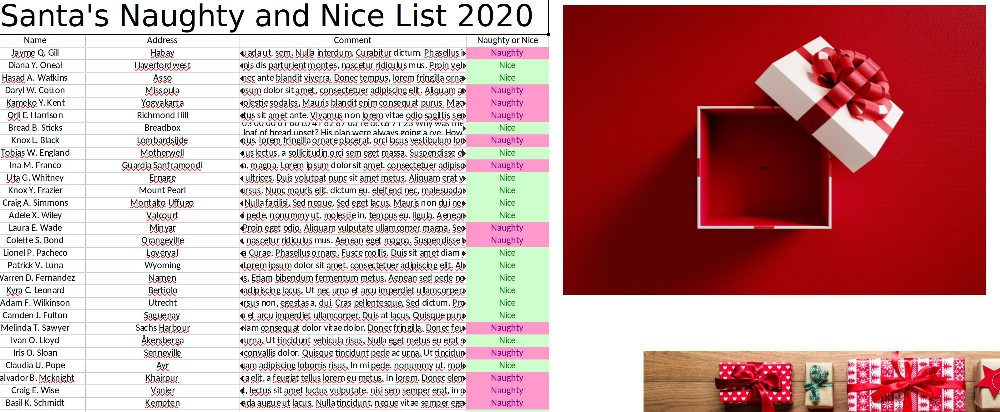

# HV20.13 Twelve steps of christmas

| <!-- --> | <!-- --> |
| --- | --- |
| **Author**     | Bread (:bread:) |
| **Level**      | hard |
| **Categories** | `forensic`, `crypto` |


## Description
On the ninth day of Christmas my true love sent to me...

- nineties style xls,
- eighties style compression,
- seventies style crypto,
- and the rest has been said previously.

[Download](./5862be5b-7fa7-4ef4-b792-fa63b1e385b7.xls)

### Hints
- Wait, Bread is on the Nice list? Better check that comment again...

## Approach

First things first, let's have a closer look at the comment in cell `C9` next to :bread:'s name. To do so, I copied over all contents from the protected sheet to a new sheet, which was no longer protected and let the user access all cells freely.

The cell contained the following text:
```
Not a loaf of bread which is mildly disappointing 1f 9d 8c 42 9a 38 41 24 01 80 41 83 8a 0e f2 39 78 42 80 c1 86 06 03 00 00 01 60 c0 41 62 87 0a 1e dc c8 71 23 Why was the loaf of bread upset? His plan were always going a rye. How does bread win over friends? “You can crust me.” Why does bread hate hot weather? It just feels too toasty.
```
The hex values looked like they form a `.tar.z` (here's the 80s style compression) file, so let's re-create that and uncompress it:
```bash
echo "1f9d8c429a384124018041838a0ef239784280c186060300000160c04162870a1edcc87123" | xxd -r -p > c9_comment.tar.z
uncompress -k c9_comment.tar.z  # Results in corrup bitmap or bitmap header
```

The resulting file seemed to be a chopped off Bitmap header hinting for an image with dimensions 551x551. But where's the rest?

Time to have a closer look at the original `.xls` file. Wasn't there a small string in one of the gift boxes?



There was! Double-clicking on it in the unprotected sheet uncovered a text file containing hex numbers, also producing a `.tar.z` file:
```bash
xxd -r -p part9.hex.txt part9.tar.z
uncompress -k part9.tar.z
```

The resulting file looked somewhat odd:
```bash
$ hexdump -C part9.tar | head -2
00000000  53 61 6c 74 65 64 5f 5f  5c ea a7 a1 22 1f 14 38  |Salted__\..."..8|
00000010  30 77 91 72 c8 5b 85 83  d1 3e 82 9a e9 2f d5 02  |0w.r.[...>.../..|
```

The `file` command gave a somewhat more clear explanation:
```bash
$ file part9.tar
part9.tar: openssl enc'd data with salted password
```

At this point, the hypothesis was that part9.tar contains the missing bmp body. This was motivated mostly by the almost matching file size. However, the body was encrypted which, as it turned out, was more a psychological hurdle than a technical one.

By simply concatenating the BMP header and the BMP body (first remove the 16 first bytes holding the salt), interpretable BMP image was created.
Looking at the image in GIMP and keeping only the red channel, an image with an almost readable QR code appeared.

"Select by color" and GIMP's "Selection Editor" did the rest and gave me a readable QR code which contained the flag:


The effect that could be observed here are visible DES-ECB errors and is known to appear with block ciphers and is described at https://en.wikipedia.org/wiki/Block_cipher_mode_of_operation#Electronic_codebook_(ECB).

## Flag
`HV20{U>watchout,U>!X,U>!ECB,Im_telln_U_Y.HV2020_is_comin_2_town}`
