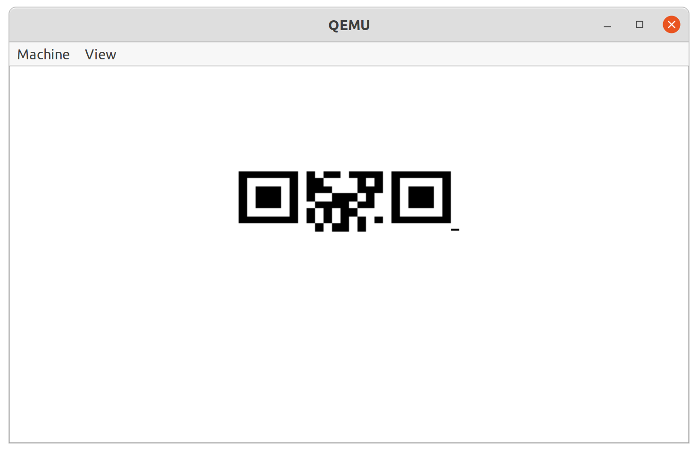
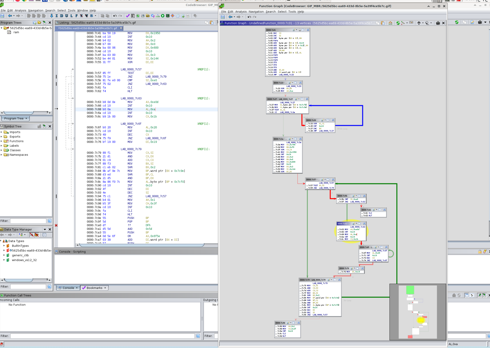
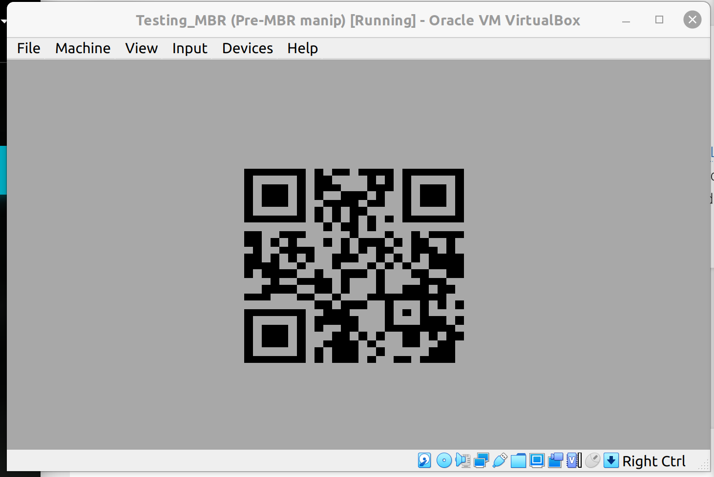

# HV20.14 Santa's Special GIFt

| <!-- --> | <!-- --> |
| --- | --- |
| **Author**     | The Compiler |
| **Level**      | hard |
| **Categories** | `reverse engineering`, `forensic` |

## Description
Today, you got a strange GIFt from Santa:


You are unsure what it is for. You do happen to have some wood lying around, but the tool seems to be made for metal. You notice how it has a rather strange size. You could use it for your fingernails, perhaps? If you keep looking, you might see some other uses...

## Approach

I started analysing the GIF file (using https://www.w3.org/Graphics/GIF/spec-gif89a.txt and https://github.com/corkami/pics/blob/master/binary/GIF.png):
```
Header:     47 49 46 38 39 61       GIF89a
Logical screen descriptor:
- width:      80 00                  => 128
- height:     10 00                   => 16
- Packed fields: a1   => Has GCT, Color resolution: 2, sort: 0, size of GCT: 1 (3*(2^2)=12)
- Background color: 03
- def. pixel spect ratio: 00
Global Color Table: (0d-19) (3 bytes per color [R G B] => 4 colors): 00 00 00 fe 00 00 9d 9d 9d fd fd fd
Graphic Comment Extension (0x1a): 21 fe ==> (0x3 bytes) 00 eb 04
Graphic Comment Extension (0x20 - 111/0xee): 21 fe ==> (0xee bytes) 31 db b4 0e 8a  87 f4 7c 8a 8f 9e 7c 84 c0 74 07 30 c8 cd 10 43  eb ed b8 00 07 b7 f0 31 c9 ba 50 19 cd 10 b4 02  b7 00 ba 00 06 cd 10 ba 03 00 be 44 01 31 ff 85  ff 75 1e 81 fe e0 00 75 02 fa f4 b8 0d 0e cd 10  b0 0a cd 10 b9 1b 00 b0 20 cd 10 49 75 f9 bf 19  00 89 f1 21 d1 01 c9 89 f3 c1 eb 02 8b af 9e 7c  d3 ed 21 d5 8a 86 f0 7c cd 10 4f 4e 75 c1 b4 01  b5 3f cd 10 fa f4 55 5d df d5 5d 55 0d 5e 6f 03  39 57 23 11 94 1b de 0c 8c 2b 37 bf 80 53 15 4e  54 94 9a d6 5f 2d a1 cf cf 50 8a 0f a5 9d a9 ed  29 84 48 6c 9c f8 44 8e 51 b2 a9 b9 1f 39 54 55  37 63 76 55 c5 d5 7c 49 e4 5c 0d 03 73 a4 16 33  30 54 c5 44 97 4c 55 00 db df dc 20 58 57 97 83 6f 65 76 36 5e 67 5d 64 4d 3c a5 75 f3 7c e0 1f  06 d1 ad 66 24 78 3c a3 e7
Image separator (0x112): 0x2c
- left pos: 0x00
- top pos: 0x00
- width: 0x80
- height 0x10
- packed byte: 0x00
- bits per LZW code: 0x02
- block size: 0xc7
- data (until 0x1e5): 84 8f a9 cb ed cf 86 9c f2 d0  8b 33 76 17 08 0f 7e 62 48 8e 66 89 9e 6a ca 1a  19 10 04 80 46 77 48 8c e7 f2 5c ad 3e fb 0b 02  87 23 d0 06 c7 ab 51 12 ba 66 93 67 10 4a 89 d4  a9 ef d3 c9 25 5f 37 a7 f7 59 a9 8a ad e3 aa e0  c3 d4 36 be ec ef ac 4c 8e c3 49 9e b3 fd 0c 6b  eb f7 ce e8 5c 0e 28 56 77 87 c7 67 68 78 10 a8  f8 47 44 58 78 08 c9 96 c8 b8 58 59 e2 f8 11 a9  d9 47 d9 69 59 84 99 b9 39 1a e3 f7 e9 c9 38 48  98 47 ba 39 79 0a 0b 87 97 86 b4 d6 aa 35 60 8a  1a 1b 87 b5 84 4b 43 ab 09 c5 bb 5b 66 94 55 aa  64 73 00 49 6c 5c 3c e5 72 24 b3 5c 23 fc 94 04  b1 cd dd ed 8d a0 61 61 3d ce 41 51 00 
Graphic Comment Extension (0x1e6): 21 fe ==> (0x11 bytes) 75 76 61 67 3a 2d 2d  78 72 72 63 2d 74 62 76  61 74
File closing (0x1fa) ==> 00 3b
Trailer (0x1fc) ==> 00 00 55 aa
```

What caught my attention was the last comment in the file which was `uvag:--xrrc-tbvat`. Turns out, this is ROT13 encoded and writes `hint:--keep-going` when converted.

`--keep-going` is a command line argument for `make` - which might be an unintended coincidence, I believe. What was intended, however, is that we should keep going in analysing the file. 

Namely, the trailer of the GIF file, which cannot be parsed in any way following the GIF file format. The trailing bytes `00 55 aa` hint towards an MBR: https://en.wikipedia.org/wiki/Master_boot_record

It turns out the file is a perfectly fine Master Boot Record.

When run, it shows a partial QR code:
```bash
qemu-system-i386 5625d5bc-ea69-433d-8b5e-5a39f4ce5b7c.gif
```


I then went on to analyse the GIF/MBR using Ghidra (architecture: x86, 16 bit, little endian, real mode; see note below).

The base address of a loaded MBR is 0x7c00, which is a useful information for this analysis (and the hidden flag that comes with this challenge, see hidden02)

INT 0x10 prints out pixels (https://en.wikipedia.org/wiki/INT_10H)



Using `hexedit` I finally patched instructions at 0x61 & 0x62 to have value 0x00 (NOP) (is this the part where we were supposed to "keep going"??).

Running the modified MBR again:
```bash
qemu-system-i386 solver_mbr.bin
```
Produced the full QR code containing the flag this time:



Note: Ghidra initially treated the file, according to its file signature, as a GIF. To actually disassemble the assembly code, I had to:
1. Right click -> clear code bytes
2. Select all, right click -> Disassemble

### Relevant links:
https://github.com/corkami/pics/blob/master/binary/GIF.png

## Tools
- Ghidra
- hexdump
- hexedit
- strings
- VirtualBox / qemu

## Flag
`HV20{54n74'5-m461c-b00t-l04d3r}`
