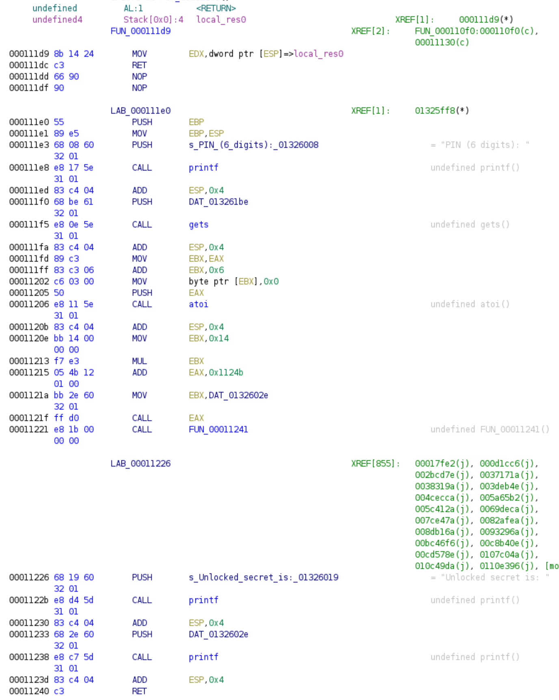
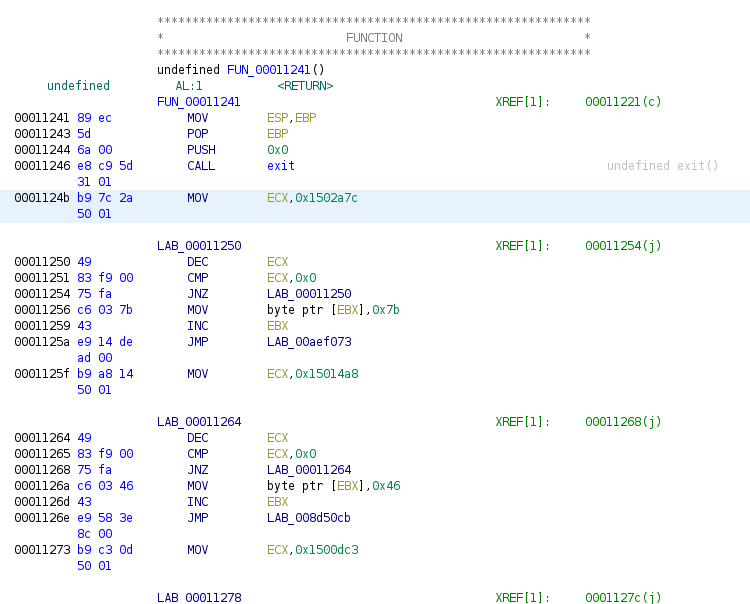

# HV20.22 Padawanlock

| <!-- --> | <!-- --> |
| --- | --- |
| **Author**     | inik |
| **Level**      | hard |
| **Categories** | `reverse engineering` |

## Description
A new apprentice Elf heard about "Configuration as Code". When he had to solve the problem to protected a secret he came up with this "very sophisticated padlock".

[Download](./6a6fbeb6-3556-4b76-ba4c-daf5f2bfffc4.zip)

## Approach

Let's get an overview of what happens in the (unzipped) file.

Running the (regular ELF) binary prompts for a PIN and then prints an "unlocked secret". 
```bash
$ ./padawanlock 
PIN (6 digits): 123456
Unlocked secret is: _IMPERIAL_CRUISER.)}
```

Secrets are always somewhat readable strings - which, however, do not appear when printing out all readable strings in the binary using `strings padawanlock`. Only the prompt and the "Unlocked secret" string can be found.

In Ghidra, I tried to find where these strings are printed. Following references to these places, I arrived at the core logic, which seems to happen at `0x000111d9`: 



- The 6-digit PIN is read.
- The PIN is used to compute a new address using the formula `PIN * 0x14 + 0x1124b`.
- Control flow jumps to the new address.
- Whenever the program returns, the string is printed out.

Looking at the first possible position at `0x1124b` (considering the base address being at `0x10000`), we discover a sequence of blocks, each turning round (supposedly to make the program slow as a brute-force prevention measure) and loading a different character to be be printed out and finally calling another block.



All blocks have the same length of 20 bytes (hence the `0x14` in the above computation).

Since we're looking for a string starting with characters `HV20{` (supposedly), we can look for blocks that load an `H` and then call to a block loading a `V`.

I started off, trying to do that in Ghidra using the Jython console, but I realised I didn't know the framework well enough, so I switched to a hybrid approach first, followed by a cleaner python-only approach.

### Approach I: Hybrid
I then went with a hybrid approach, using `xxd` and some custom `python` script:

Grep intersting blocks loading characters "H" and "V" (the string to grep for was taken over manually from Ghidra, it corresponds to binary opcodes):
```bash
# The following dumps all occurences into a text file, prefixed by the line number at which they were found.
# The line number will be helpful to compute the instruction address again.
xxd -s 3 -ps -c 20 padawanlock | grep -n 'f90075fac6034843' > H_search.txt # H == 0x48
xxd -s 3 -ps -c 20 padawanlock | grep -n 'f90075fac6035643' > V_search.txt # V == 0x56
```

With that, try to find all "H"-loading blocks that are followed by a "V"-loading block (in python):
```python
#!/usr/bin/env python

OFFSET = 0x3
LINE_WIDTH = 0x14
JUMP = 0x1124b
BASE_ADDR = 0x10000


def parse_line(line: str):
    (lnb, code) = line.split(":", 1)
    addr = OFFSET + (int(lnb) - 1) * LINE_WIDTH
    next = bytearray.fromhex(code.strip()[-4 * 2:])
    # Returns a tuple:
    # (<address of this block>, <address of referenced/next block>)
    return addr, addr + int.from_bytes(next, 'little') + LINE_WIDTH


if __name__ == "__main__":
    with open("H_search.txt", "r") as hfd:
        h_map = {x[1]: x[0] for x in [parse_line(l) for l in hfd.readlines()]}

    with open("V_search.txt", "r") as vfd:
        v_addr = [parse_line(l)[0] for l in vfd.readlines()]


    res = [(h_map[x] - (JUMP - BASE_ADDR))/0x14 for x in set(h_map.keys()).intersection(set(v_addr))]
    print(res)

```
When run, this code prints out a single result being `451235`, which corresponds to the PIN we're looking for.

### Approach II: Python only
A cleaner approach is to keep everything in python. The logic stays the same:
- We have to look for given byte sequences,
- correlate these blocks (by their address and the address of the next block they call),
- reverse the PIN-calculation
- find the PIN.

```python
#!/usr/bin/env python

BLOCK_LENGTH = 0x14
FIRST_BLOCK_ADDR = 0x1124b
ELF_BASE_ADDR = 0x10000

def find_addresses(blob, b):
    addresses = []
    needle = bytearray.fromhex(b)
    a = blob.find(needle)
    while a != -1:
        addresses.append(a - 5)
        a = blob.find(needle,a+1)
    return addresses

def find_next_addr(blob, curr_addr):
    jmp_bytes = blob[curr_addr + BLOCK_LENGTH - 4:curr_addr + BLOCK_LENGTH]
    jmp_int = int.from_bytes(jmp_bytes, 'little')
    return curr_addr + BLOCK_LENGTH + jmp_int


if __name__ == "__main__":

    # Search strings to search for all block loading "H" (0x48) or "V" (0x56).
    # These strings of bytes were identified using Ghidra.
    load_h_bytes = "4983f90075fac6034843e9"
    load_v_bytes = "4983f90075fac6035643e9"

    with open("padawanlock", "rb") as pfd:
        blob = pfd.read()

    h_loading = find_addresses(blob, load_h_bytes)
    v_loading = find_addresses(blob, load_v_bytes)

    # Create a map <next_addr> -> <current_addr> for all blocks loading "H"
    h_references = {find_next_addr(blob, addr): addr for addr in h_loading}

    # Find all blocks loading "H" that are followed by a block loading "V"
    v_refs = set(h_references.keys()).intersection(set(v_loading))
    h_addrs = [h_references[x] for x in v_refs]

    # Compute the inverse calculation of `PIN * 0x14 + 0x1124b` (need to subtract the 
    # base address at which ELF files are loaded into memory)
    print([int((x - (FIRST_BLOCK_ADDR - ELF_BASE_ADDR)) / BLOCK_LENGTH) for x in h_addrs])
```

This snippet prints the same PIN being `451235`.

When run using the resulting PIN, the binary indeed prints the flag:
```bash
$ ./padawanlock 
PIN (6 digits): 451235
Unlocked secret is: HV20{C0NF1GUR4T10N_AS_C0D3_N0T_D0N3_R1GHT}
```

## Tools
- python
- Ghidra

## Flag
`HV20{C0NF1GUR4T10N_AS_C0D3_N0T_D0N3_R1GHT}`
